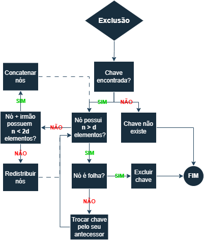

# EDB2-U3
Trabalho da unidade 3 de Estrutura de Dados Básicas 2 - Bacharelado em Tecnologia da Informação (IMD/UFRN)

### Fluxograma da exclusão na árvore B:

## Grupo:
- Filipe Fernandes Campos: Fluxograma da exclusão da árvore b
- Breno Jalmir de Medeiros Almeida: Implementação da busca e inserção
- Warlike Richard da Silva Soares: Implementação da remoção e leitura dos dados.
